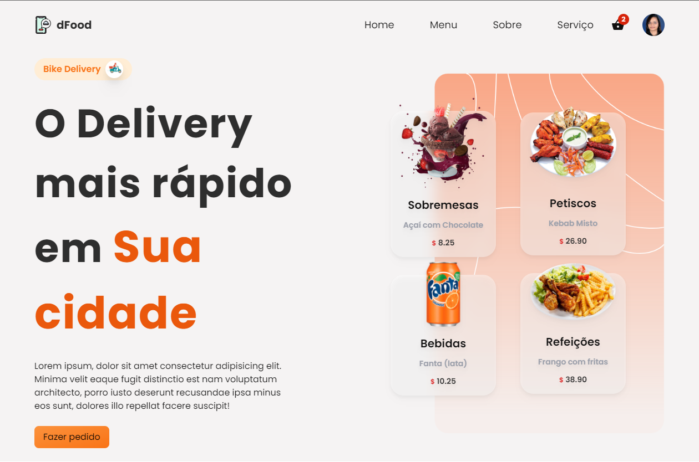
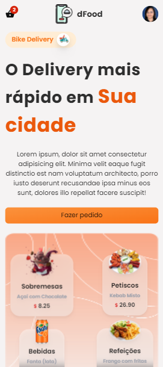
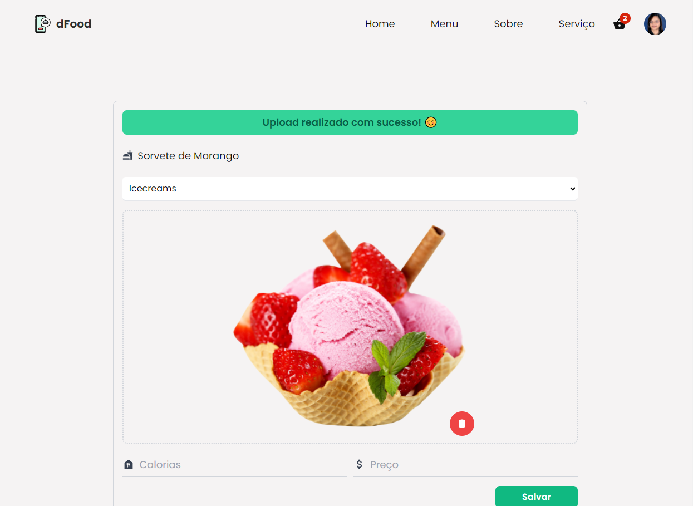
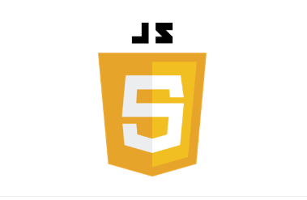
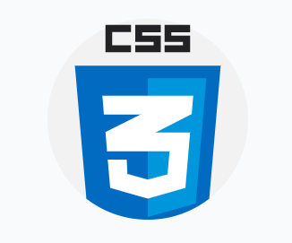

<h2 align="center">
<a href="#about">About</a>  |
<a href="#status">Status</a>  |
<a href="#preview">Preview</a>  |
<a href="#technologies">Technologies</a>  |
<a href="#contribute">Contribute</a>  | 
</h2>

<h2 id="about">🏷 About The Project</h2>

Application developed for assessment in the field of Systems Analysis topics
involving the content of Requirements Engineering and Project Modeling as part of
of its structure under the guidance of Prof. Dr. Alfredo Boente.

<h2 id="status"> 🚦Status </h2>
<h4 align="center"> 
	🚧  Delivery Food 🚀 Building...  🚧
</h4>

### Features

- [x] Login using Google
- [x] Uploading new item
- [x] Deleting items
- [ ] Food search by word
- [ ] Cart items
- [ ] Save results to database

<h2 id="preview">🔎 Preview </h2>

  
     
<h3>AppWeb</h3>

<h3>AppMobile</h3>

<h3>Dashboard</h3>

<h2 id="technologies">🧰 Used Technologies </h2>

&nbsp;&nbsp;&nbsp;
&nbsp;&nbsp;&nbsp;
&nbsp;&nbsp;&nbsp;
&nbsp;&nbsp;&nbsp;
&nbsp;&nbsp;&nbsp;
&nbsp;&nbsp;&nbsp;  
**Note: ainda em edição!**
