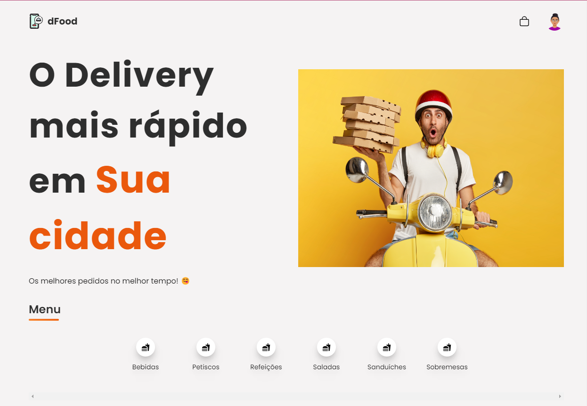
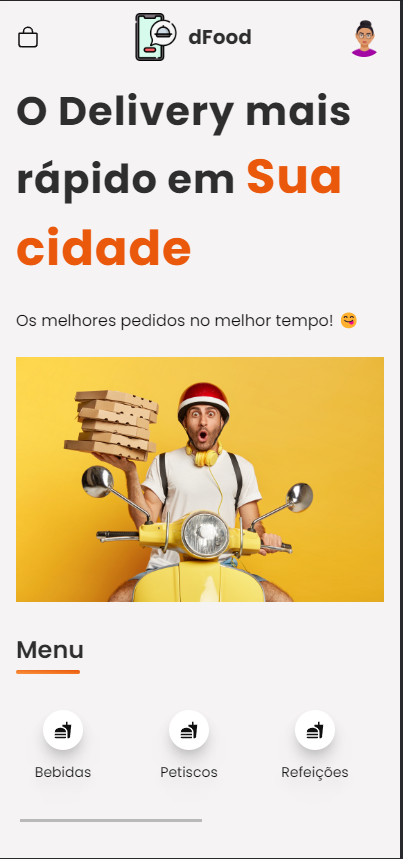

<h1 align="center" style="font-size:3.4rem">Delivery Food<h1>

<h1 align="center">
 
</h1>

<h2 align="center">
<a href="#about">About</a>  |
<a href="#status">Status</a>  |
<a href="#preview">Preview</a>  |
<a href="#technologies">Technologies</a>  |
<a href="#contribute">Contribute</a>  | 
</h2>

<h2 id="about">🏷 About The Project</h2>

Application developed for assessment in the field of Systems Analysis topics
involving the content of Requirements Engineering and Project Modeling as part of
of its structure under the guidance of Prof. Dr. Alfredo Boente.

<h2 id="status"> 🚦Status </h2>
<h4 align="center"> 
	🚧  Delivery Food 🚀 Building...  🚧
</h4>

### Features

- [x] Login using Google
- [x] Uploading new item
- [x] Deleting items
- [ ] Food search by word
- [ ] Cart items
- [ ] Save results to database

<h2 id="preview">🔎 Preview </h2>

  
     
<h3>AppWeb</h3>

<h3>AppMobile</h3>

<h3>Dashboard</h3>

<h2 id="technologies">🧰 Used Technologies </h2>

&nbsp;&nbsp;&nbsp;
&nbsp;&nbsp;&nbsp;
&nbsp;&nbsp;&nbsp;
&nbsp;&nbsp;&nbsp;
&nbsp;&nbsp;&nbsp;
&nbsp;&nbsp;&nbsp;  

<h2 id="contribute">🖇 Contribute</h2>

    💡 Explore your creativity and skills
    📥 Make a fork
    🔱 Create a branck with your feature
    〽 Commit changes
    💠 Make a push to your branch

<h3>&nbsp;That's it! 🖖</h3>

Try and miss again until its works.&nbsp;

**Note: ainda em edição!**
