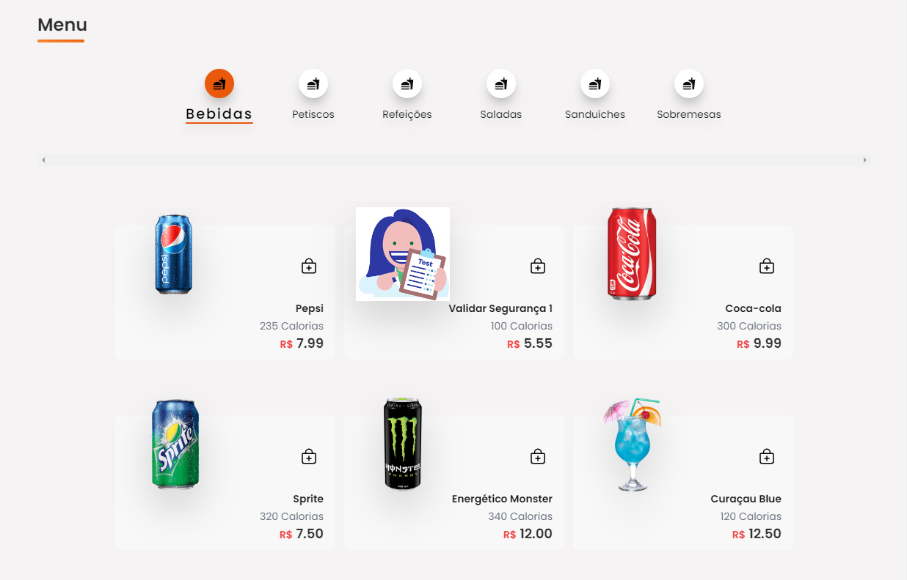
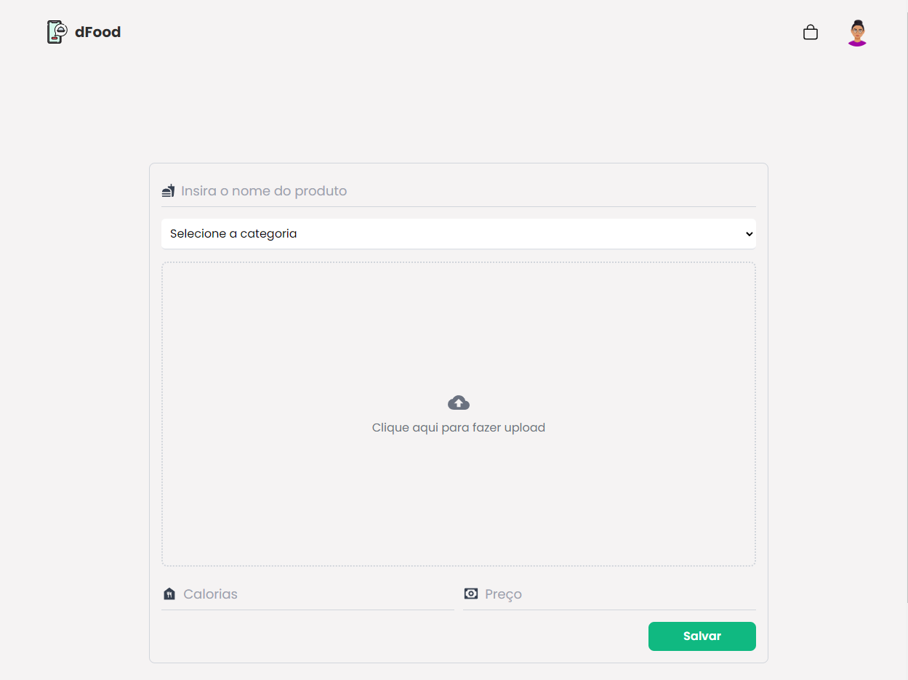
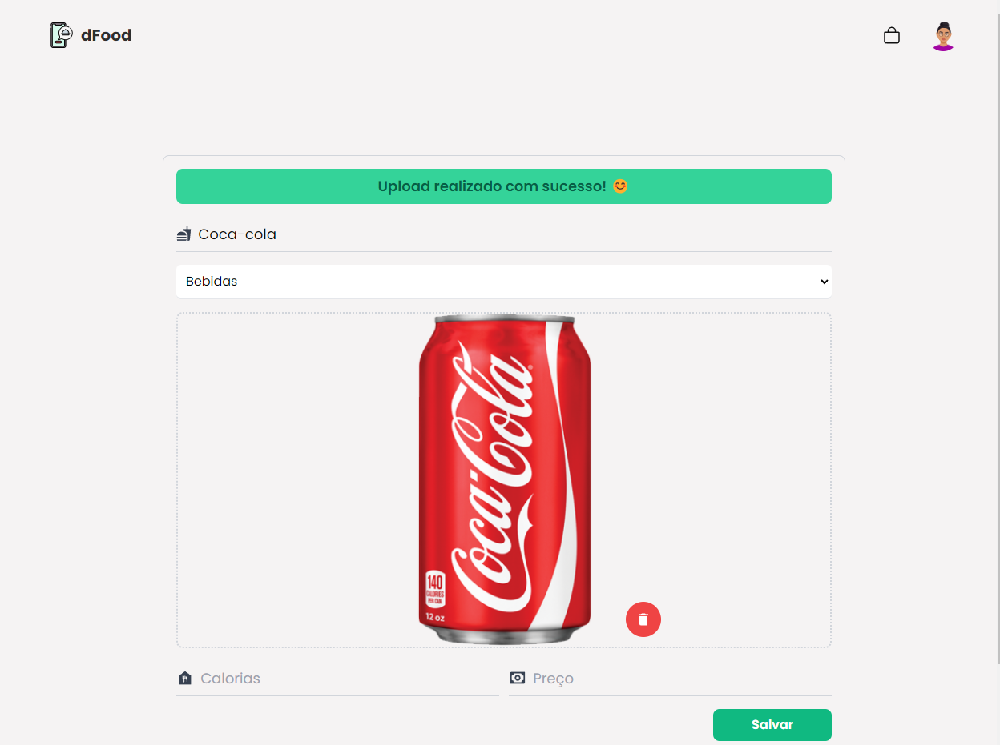
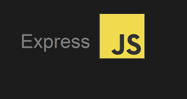

<h1 align="center" style="font-size:3.4rem">Delivery Food by Camila Isabela<h1>

<h1 align="center">
 
</h1>

<h2 align="center">
<a href="#about">About</a>  |
<a href="#status">Status</a>  |
<a href="#preview">Preview</a>  |
<a href="#technologies">Technologies</a>  |
<a href="#contribute">Contribute</a>  | 
</h2>

<h2 id="about">🏷 About The Project</h2>

Aplicação da categoria eCommerce em desenvolvimento para obtenção de conhecimento prático na área de Programação Web e Mobile utilizando React, Componentização, Imutabilidade, Login Social e Gerenciamento de Dados com a plataforma Firebase.

Link: <a>https://dfoo.netlify.app/</a>

<h2 id="status"> 🚦Status </h2>
<h4 align="center"> 
	🚧  Delivery Food 🚀 Building...  🚧
</h4>

### Features

- [x] Login usando Google
- [x] Uploading de novo item
- [x] Deletar items
- [ ] Encontrar itens pela palavra
- [x] Cart de items
- [x] Salvar resultados no database

<h2 id="preview">🔎 Preview </h2>

  
     
<h3>App Web</h3>

<h3>Menu</h3>

<h3>App Mobile</h3>

<h3>Dashboard</h3>

<h2 id="technologies">🧰 Tecnologias </h2>

&nbsp;&nbsp;&nbsp;
&nbsp;&nbsp;&nbsp;
&nbsp;&nbsp;&nbsp;
&nbsp;&nbsp;&nbsp;
&nbsp;&nbsp;&nbsp;
&nbsp;&nbsp;&nbsp;
&nbsp;&nbsp;&nbsp;  

<h2 id="contribute">🖇 Contribuindo...</h2>

    💡 Explore your creativity and skills
    📥 Make a fork
    🔱 Create a branck with your feature
    〽 Commit changes
    💠 Make a push to your branch

<h3>&nbsp;That's it! 🖖</h3>

Try and miss again until its works.&nbsp;

**Note: ainda em edição!**
